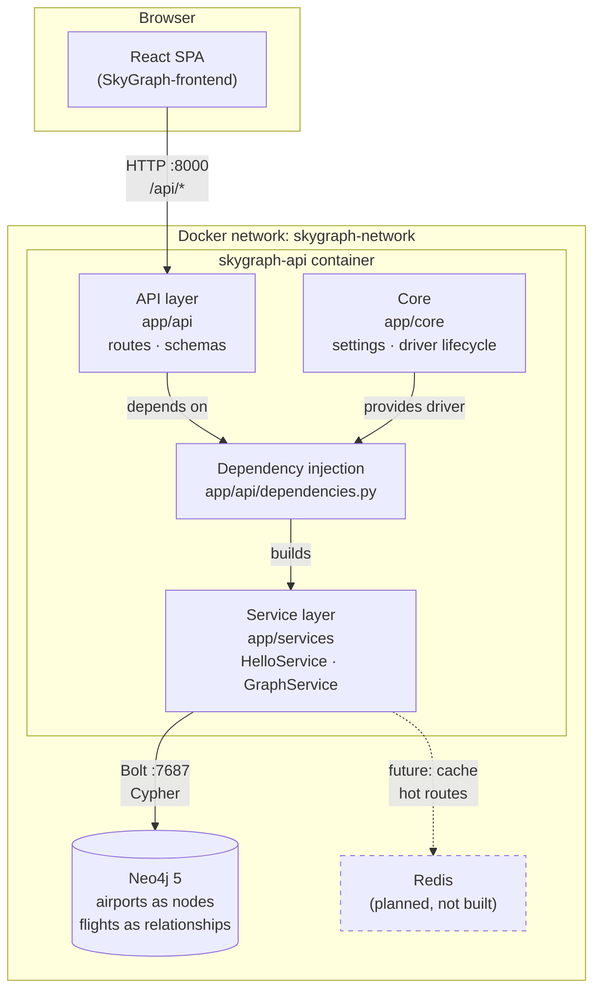

# SkyGraph — Backend

FastAPI service that computes **optimal flight routes between two airports** using a
Neo4j graph database.

Part of the SkyGraph system:

| Repository                                                                          | Role                            |
| ----------------------------------------------------------------------------------- | ------------------------------- |
| [SkyGraph-frontend](https://github.com/ProjetoIntegrador3b/SkyGraph-frontend)         | React single-page application   |
| **SkyGraph-backend** (this repo)                                                      | REST API + graph database       |

---

## What the system does

The user supplies an **origin** and a **destination** airport. The API searches the
flight graph and returns the *optimal* route between them — which is not necessarily
the shortest one in kilometres.

Airports are modelled as **nodes** and flights as **relationships** between them, so
"find the best route" becomes a weighted graph traversal — the problem Neo4j is
built for, and the reason it was chosen over a relational database. Expressing the
same query in SQL would require an arbitrary number of self-joins, one per
connection.

### Route weights

A route is scored against several factors rather than a single one:

| Weight               | Meaning                                                |
| -------------------- | ------------------------------------------------------ |
| Price                | Total ticket cost across all legs                      |
| Number of connections| Fewer stops is generally preferable                    |
| Total time           | Flight duration plus time spent in layovers            |

> The weighting model is the core of the project and is still being designed. The
> API currently exposes only the hello-world and health endpoints described below.

---

## Tech stack

| Layer          | Choice                          | Notes                                                     |
| -------------- | ------------------------------- | --------------------------------------------------------- |
| Language       | Python 3.13                     |                                                           |
| Web framework  | FastAPI 0.141                   | Async, with generated OpenAPI docs                        |
| Server         | Uvicorn 0.52                    | ASGI server                                               |
| Database       | Neo4j 5 (Community)             | Graph database holding airports and flights               |
| Driver         | `neo4j` 6.3 (async)             | Official driver, connection-pooled                        |
| Settings       | pydantic-settings 2.15          | Environment-based configuration                           |
| Tests          | pytest 9 + httpx                | ASGI transport, no live server needed                     |
| Lint + format  | Ruff 0.16                       | Replaces flake8/isort/black in one tool                    |
| Container      | Docker + Docker Compose         | API and database both containerised                       |

**Planned:** a Redis cache for frequently requested routes, so popular
origin/destination pairs skip the graph traversal entirely. Not implemented yet.

---

## Architecture



### Request flow

1. A route handler in `app/api/routes.py` declares what it needs (e.g. `GraphServiceDep`).
2. FastAPI resolves that through the providers in `app/api/dependencies.py`.
3. The provider builds a service, handing it the Neo4j driver taken from app state.
4. The service runs the Cypher query and returns plain data; the handler shapes the response.

Handlers never touch the driver directly. That indirection is what lets the test
suite swap in a fake graph service and run **without a database**.

### Layout

```
app/
├── api/
│   ├── dependencies.py   # DI providers — the seam used by tests
│   ├── routes.py         # HTTP handlers (thin)
│   └── schemas.py        # Pydantic response models
├── core/
│   ├── config.py         # Settings loaded from the environment
│   └── neo4j.py          # Driver creation and lifecycle
├── services/
│   ├── graph.py          # GraphService — talks to Neo4j
│   └── hello.py          # HelloService
└── main.py               # create_app() + lifespan
tests/                    # pytest suite, database-free
```

### Driver lifecycle

The Neo4j driver is connection-pooled and expensive, so **exactly one** is created
per process: built in the FastAPI `lifespan` on startup, stored on app state, closed
on shutdown.

Creating the driver does **not** open a connection. The API therefore starts
successfully even when Neo4j is not ready yet, and reports the problem through
`/api/health` instead of crash-looping.

---

## Endpoints

| Method | Path          | Description                                                     |
| ------ | ------------- | --------------------------------------------------------------- |
| GET    | `/api/hello`  | Hello world — returns `{"message": "Hello SkyGraphers"}`         |
| GET    | `/api/health` | Neo4j connectivity; `200` when reachable, `503` when not         |

Interactive OpenAPI docs: **http://localhost:8000/docs**

---

## Running with Docker (recommended)

The network is shared with the frontend stack, so create it once:

```bash
docker network create skygraph-network
docker compose up -d --build
```

| Service       | URL                     |
| ------------- | ----------------------- |
| API           | http://localhost:8000   |
| OpenAPI docs  | http://localhost:8000/docs |
| Neo4j Browser | http://localhost:7474   |
| Neo4j Bolt    | `bolt://localhost:7687` |

Neo4j credentials: `neo4j` / `skygraph`.

Compose starts Neo4j first and waits for its healthcheck before starting the API.
Graph data lives in named volumes and survives `docker compose down`; add
`--volumes` to wipe it.

### Port conflicts

If a default port is already taken on your machine, override it:

```bash
API_PORT=8010 docker compose up -d
```

`API_PORT`, `NEO4J_HTTP_PORT` and `NEO4J_BOLT_PORT` are all overridable. See
`.env.example`.

---

## Running locally (without Docker)

Neo4j still needs to be running — start just that container with
`docker compose up -d neo4j`.

```bash
uv venv --python 3.13
uv pip install -e ".[dev]"

.venv/bin/uvicorn app.main:app --reload
```

Configuration comes from the environment; copy `.env.example` to `.env` and adjust.

| Variable         | Default                 | Meaning                    |
| ---------------- | ----------------------- | -------------------------- |
| `NEO4J_URI`      | `bolt://localhost:7687` | Database address           |
| `NEO4J_USER`     | `neo4j`                 | Username                   |
| `NEO4J_PASSWORD` | `skygraph`              | Password                   |
| `NEO4J_DATABASE` | `neo4j`                 | Database name              |

### CORS

Browsers block cross-origin calls unless the API names the origins it trusts.

| Variable            | Default                                                        | Meaning                             |
| ------------------- | -------------------------------------------------------------- | ----------------------------------- |
| `CORS_ORIGINS`      | localhost:5173, localhost:3000, `https://sky-graph-frontend.vercel.app` | Comma-separated allowed origins |
| `CORS_ORIGIN_REGEX` | matches `sky-graph-frontend-*.vercel.app`                       | Allows Vercel preview deployments   |

Credentials are disabled (`allow_credentials=False`) because the API uses no
cookies or auth headers. When authentication is added, enable them and keep the
origin list exact.

---

## Development

```bash
.venv/bin/pytest              # run the test suite
.venv/bin/ruff check .        # lint
.venv/bin/ruff format .       # format
.venv/bin/ruff format --check .  # verify formatting without writing
```

### Tests

The suite uses FastAPI's `dependency_overrides` to replace `GraphService` with a
fake, so tests are fast and need no database. Coverage includes the hello endpoint,
the health endpoint in its reachable / unreachable / driver-raises states, and the
DI providers themselves.

---

## Continuous integration

`.github/workflows/ci.yml` runs on every pull request to `main`:

| Check                | Blocks merge?                             |
| -------------------- | ----------------------------------------- |
| `ruff format --check`| **No** — warns only, annotating the files |
| `ruff check`         | **Yes**                                   |
| `pytest`             | **Yes**                                   |
| Docker stack builds  | **Yes** — boots Compose and smoke-tests the API against a real Neo4j |

Formatting is intentionally advisory: it reports unformatted files as PR
annotations, but never blocks the merge.
